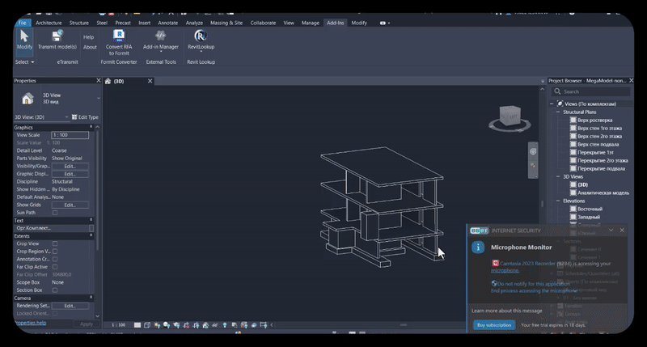

</div>

<div align="center">
    <a href="https://github.com/bezawy/ParametersQCIT/releases/latest">
        
    </a>
    <a href="https://github.com/bezawy/ParametersQCIT/releases/latest">
        
    </a>
    <a href="https://github.com/bezawy/ParametersQCIT/commits/main">
        
    </a>
</div>

<br/>

---

## 🎬 Demo Video

<div align="center">
  
</div>

# ExportCADX

 
  
**Advanced Revit to DXF Geometry Exporter**

ExportCADX is a Revit External Application allowing users to export specific Revit element categories (Walls, Windows, Structural Framing) into clean, mathematically precise DXF files. It utilizes the **netDxf** library to generate geometry and implements the **MVVM** pattern for a responsive, modern UI.

## 🚀 Features

  * **Selective Export:** Target specific categories:
      * **Walls:** Exports face boundaries.
      * **Windows:** Exports family geometry (including nested instances).
      * **Structural Framing:** Exports beam geometry.
  * **Geometry Conversion:** High-fidelity conversion of Revit geometry to DXF entities:
      * `Revit.Line` → `DXF.Line` / `DXF.Ray`
      * `Revit.Arc` → `DXF.Arc` / `DXF.Circle`
      * `Revit.Ellipse` → `DXF.Ellipse`
      * `Revit.NurbSpline` → `DXF.Polyline3D` (via tessellation)
  * **Modern UI:** Built with WPF, MaterialDesign, and CommunityToolkit MVVM.

## 🛠 Tech Stack & Dependencies

| Component | Technology |
| :--- | :--- |
| **Platform** | Autodesk Revit API (C\#) |
| **DXF Engine** | [netDxf](https://github.com/haplokuon/netDxf) |
| **UI Pattern** | MVVM (Model-View-ViewModel) |
| **MVVM Lib** | `CommunityToolkit.Mvvm` |
| **UI Styling** | `MaterialDesignThemes` |

-----

## 📂 Project Architecture

### 1\. Entry Point (`MainCommand.cs`)

The entry point implementing `IExternalCommand`. It initializes the `ViewCommand` (ViewModel) and launches the `UserControl1` (View) as a dialog.

### 2\. UI & ViewModels (`Views/`, `ViewModels/`)

| Class | Description |
| :--- | :--- |
| **`ViewCommand.cs`** | The **ViewModel**. Handles UI logic, folder selection (`FolderBrowserDialog`), and commands (`RelayCommand`). It routes the export request to the logic layer. |
| **`UserControl1.xaml`** | The **View**. A WPF Window styled with Material Design. Contains inputs for Export Type, Folder Path, and Format selection (DXF/DWG/XML). |
| **`ExportRequest.cs`** | A simple **Model** class used to pass user selection data (ElementType, Format, Path) from the UI to the Exporter. |

### 3\. Core Logic (`geoutills/`)

This is the engine of the application, handling the translation of Revit geometry to .dxf format.

#### `DXFGeomExporter`

The main controller for the export process.

  * **`Init()`**: Handles directory creation.
  * **`ExportWallsByFaces`**: Iterates over Wall Solids → Faces → EdgeLoops.
  * **`ExportFamilyInstancesByFaces`**: Handles geometry extraction for Windows and Framing, including nested geometry recursion.

#### `netDxfEntityUtils`

A static helper class that acts as the **Geometry Bridge**. It converts Revit mathematical objects into `netDxf` entities.

-----

## 🧩 Geometry Conversion Logic

The application uses a specific logic to handle complex Revit geometry:

```csharp
// Pseudocode logic flow found in netDxfEntityUtils.cs

public static EntityObject Convert(GeometryObject revitGeo)
{
    if (revitGeo is Arc) 
    {
        // Calculate start/end angles relative to center
        // Return new netDxf.Entities.Arc();
    }
    else if (revitGeo is Line)
    {
        // Check if Bound (Line) or Unbound (Ray)
        // Return new netDxf.Entities.Line();
    }
    else if (revitGeo is NurbSpline)
    {
        // Tessellate points
        // Return new netDxf.Entities.Polyline3D();
    }
}
```

## 📥 Installation & Usage

1.  **Clone** the repository.
2.  **Restore NuGet Packages**:
      * `netDxf`
      * `CommunityToolkit.Mvvm`
      * `MaterialDesignThemes`
3.  **Build** the solution (Ensure references to `RevitAPI.dll` and `RevitAPIUI.dll` are set to `Copy Local: False`).
4.  **Load** the DLL into Revit using Add-in Manager or a `.addin` manifest.
5.  **Run** the command `MainCommand`.

## ⚠️ Status

  * ✅ **DXF Export:** Fully Implemented.
  * 🚧 **DWG Export:** Placeholder (Not implemented).
  * 🚧 **XML Export:** Placeholder (Not implemented).

-----
